# windows를 탈출하자! (vagrant 설치)
* mac사용자의 경우 [이곳](https://gorails.com/setup/osx/10.13-high-sierra) 참조
## versions / install

* [virtualBox](https://download.virtualbox.org/virtualbox/5.1.30/) : 5.1.30

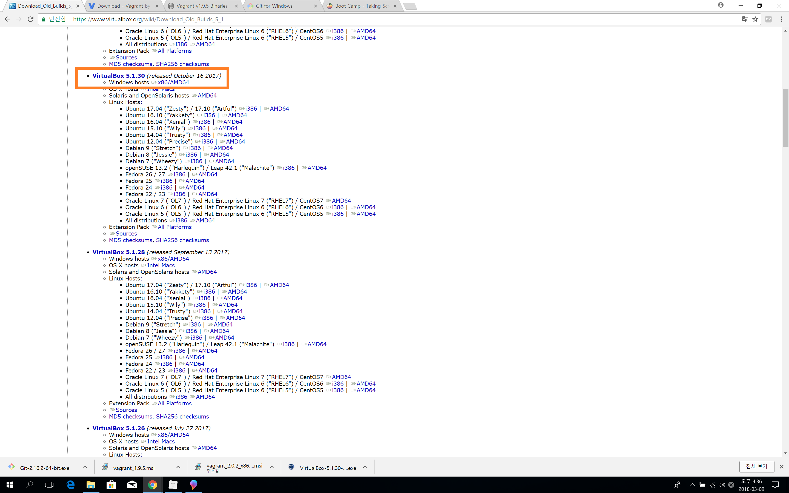

* [Vagrant](https://releases.hashicorp.com/vagrant/?_ga=2.237010176.1475687836.1513147132-756484628.1513147132) : 1.9.5

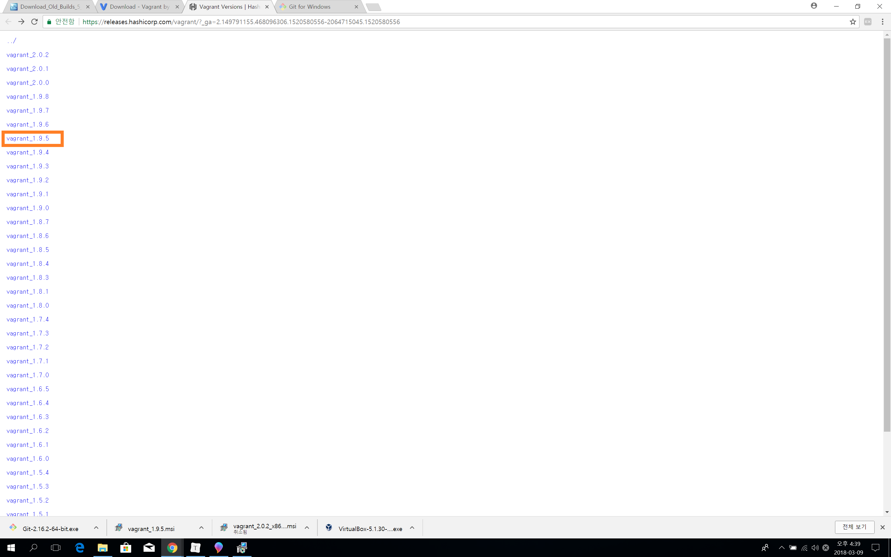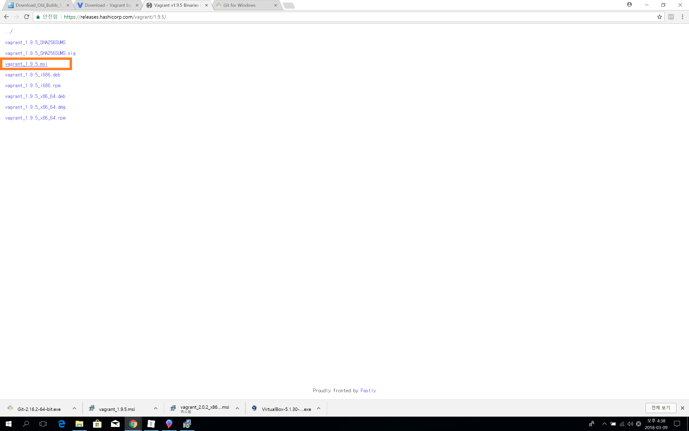

* [git for windows](https://git-for-windows.github.io/) - git bash

- *모든 설치는 default로*
- atom이나 sublime과 같은 text-editor도 설치하기

#### setting - vagrant

1. Windows에서 폴더 하나를 만든다. (vagrant 가상 환경과 windows와 공유하는 폴더가 될 예정임.)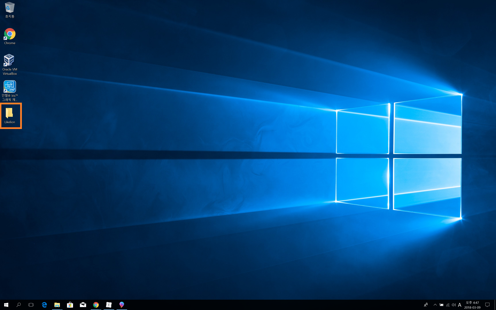
2. 해당 폴더의 경로에서 git bash 창을 연다.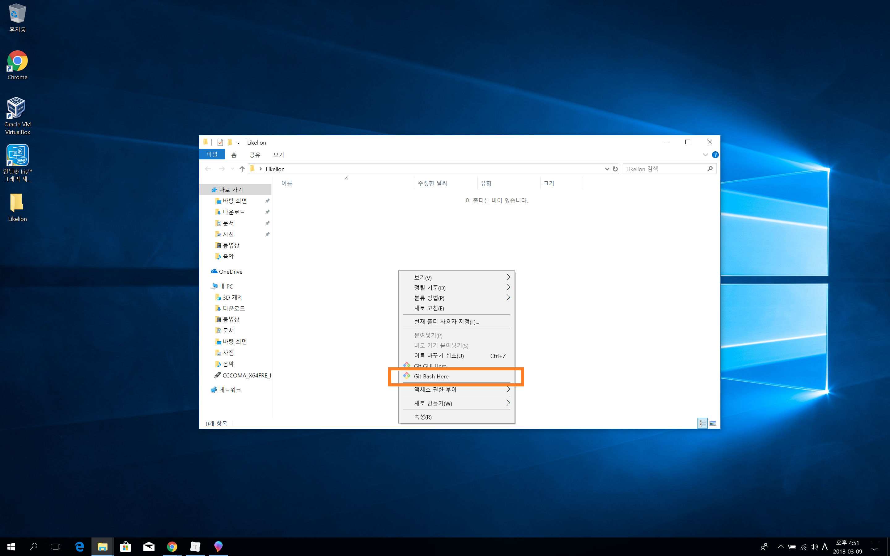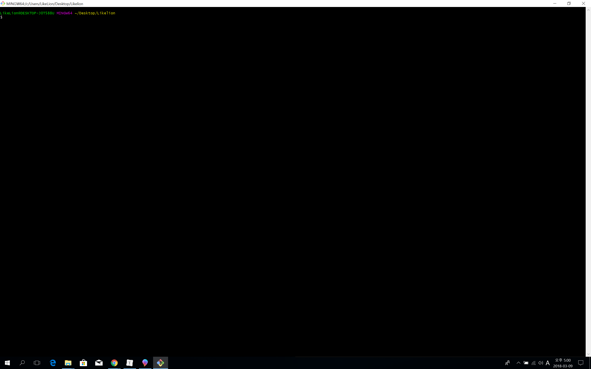

```console
$ vagrant init
```

3. Vagrantfile이 생겼을텐데, 이를 수정하고 저장한다.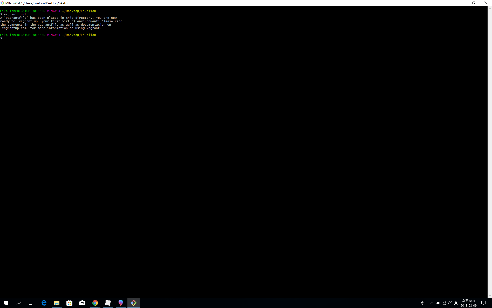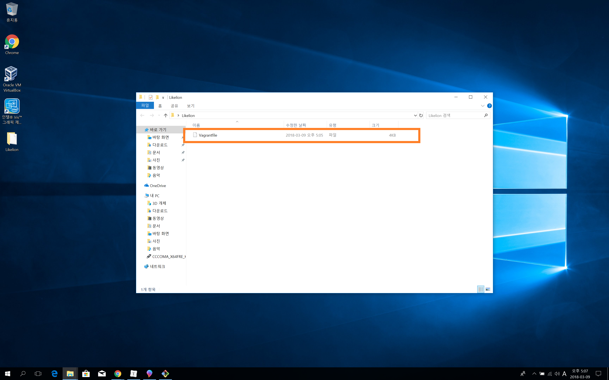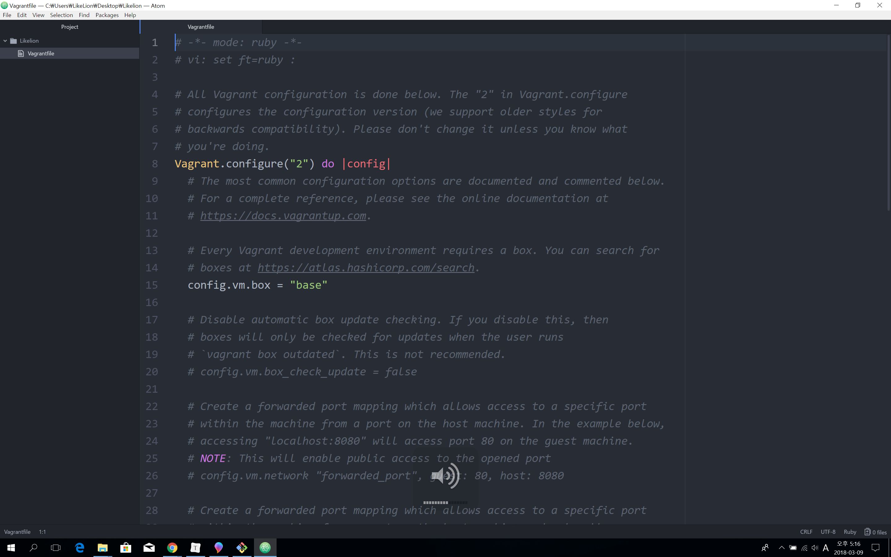

```
# 다음 내용으로 수정
Vagrant::DEFAULT_SERVER_URL.replace("https://vagrantcloud.com")
Vagrant.configure("2") do |config|
  config.vm.box = "ubuntu/xenial64"
  config.vm.network "forwarded_port", guest: 3000, host: 3000
  config.vm.network "forwarded_port", guest: 4567, host: 4567
end
```

4. 가상 환경을 만든다.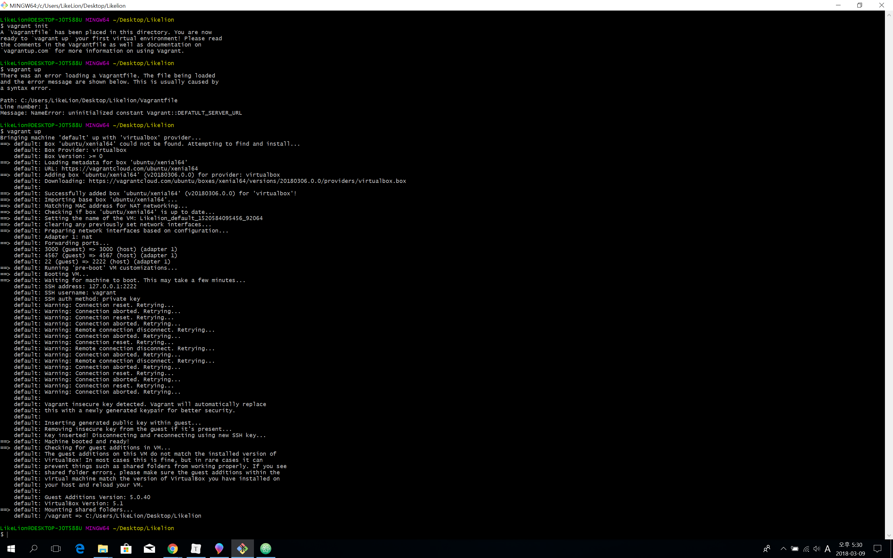 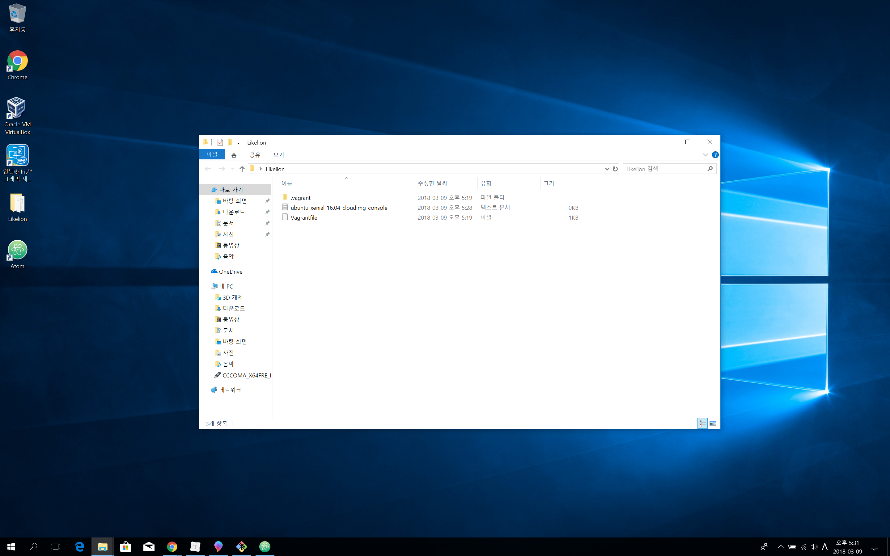

```console
$ vagrant up
```

5. 가상환경에 접속한다.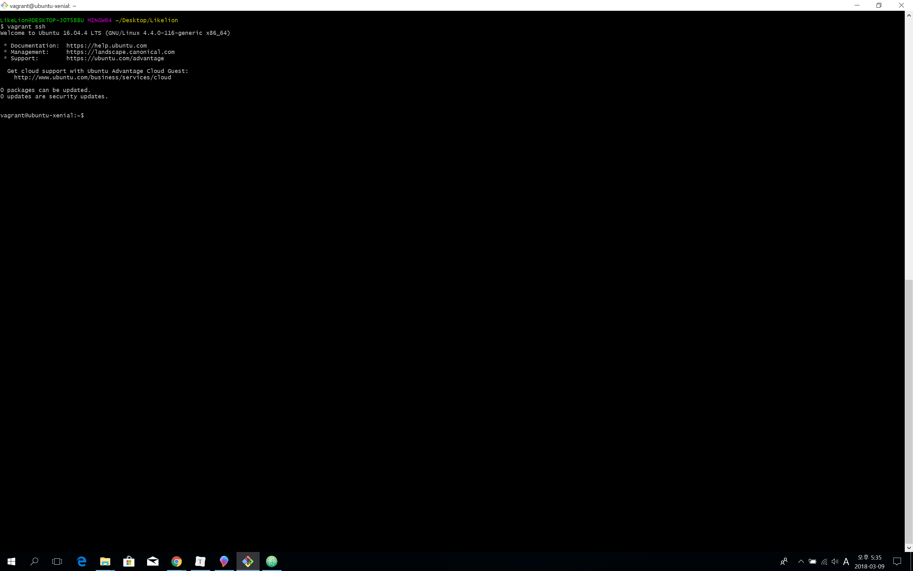

```console
$ vagrant ssh
```

6. 가상머신에 접속된 상태에서 공유폴더에 접근한다.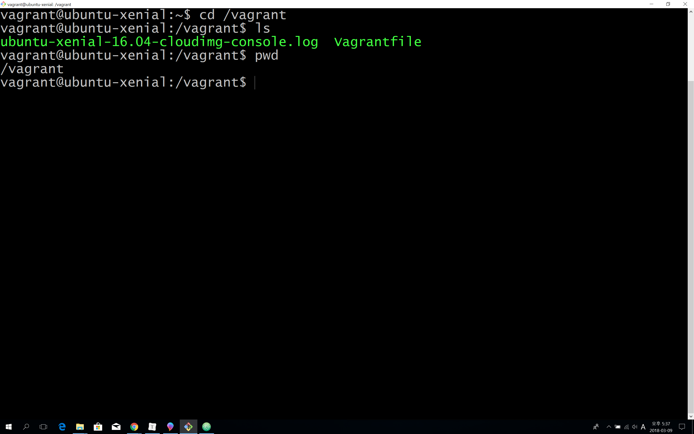

```console
$ cd /vagrant
```

## setting - vagrant 내 루비 개발 환경

> 루비버전은 2.3.5로 맞춘다.

**아래의 코드들은 반드시 가상 환경 내에서 입력해야합니다.**
git bash 창에서 `ubuntu@ubuntu-xenial:~$` 확인!

```console
$ vagrant ssh
Welcome to Ubuntu 16.04.3 LTS (GNU/Linux 4.4.0-103-generic x86_64)

 * Documentation:  https://help.ubuntu.com
 * Management:     https://landscape.canonical.com
 * Support:        https://ubuntu.com/advantage

  Get cloud support with Ubuntu Advantage Cloud Guest:
    http://www.ubuntu.com/business/services/cloud

0 packages can be updated.
0 updates are security updates.


Last login: Wed Dec 13 07:26:42 2017 from 10.0.2.2
ubuntu@ubuntu-xenial:~$

```

1. 아래의 코드를 git bash 창에 복붙한다. **반드시 vagrant 환경 내에서**

```console
curl -sL https://deb.nodesource.com/setup_8.x | sudo -E bash -
curl -sS https://dl.yarnpkg.com/debian/pubkey.gpg | sudo apt-key add -
echo "deb https://dl.yarnpkg.com/debian/ stable main" | sudo tee /etc/apt/sources.list.d/yarn.list

sudo apt-get update
sudo apt-get install git-core curl zlib1g-dev build-essential libssl-dev libreadline-dev libyaml-dev libsqlite3-dev sqlite3 libxml2-dev libxslt1-dev libcurl4-openssl-dev python-software-properties libffi-dev nodejs yarn
```

2. 한번 더 한땀한땀.. git bash 창에..

```console
cd
git clone https://github.com/rbenv/rbenv.git ~/.rbenv
echo 'export PATH="$HOME/.rbenv/bin:$PATH"' >> ~/.bashrc
echo 'eval "$(rbenv init -)"' >> ~/.bashrc
exec $SHELL

git clone https://github.com/rbenv/ruby-build.git ~/.rbenv/plugins/ruby-build
echo 'export PATH="$HOME/.rbenv/plugins/ruby-build/bin:$PATH"' >> ~/.bashrc
exec $SHELL

rbenv install 2.3.5
rbenv global 2.3.5
ruby -v
```


3. 한번 더! git bash 창에..

```console
gem install bundler
rbenv rehash
```

추가적으로, git 설정을 vagrant 환경에서 다시 해줘야합니다.

```console
git config --global user.name "YOUR NAME"
git config --global user.email "YOUR@EMAIL.com"
```
